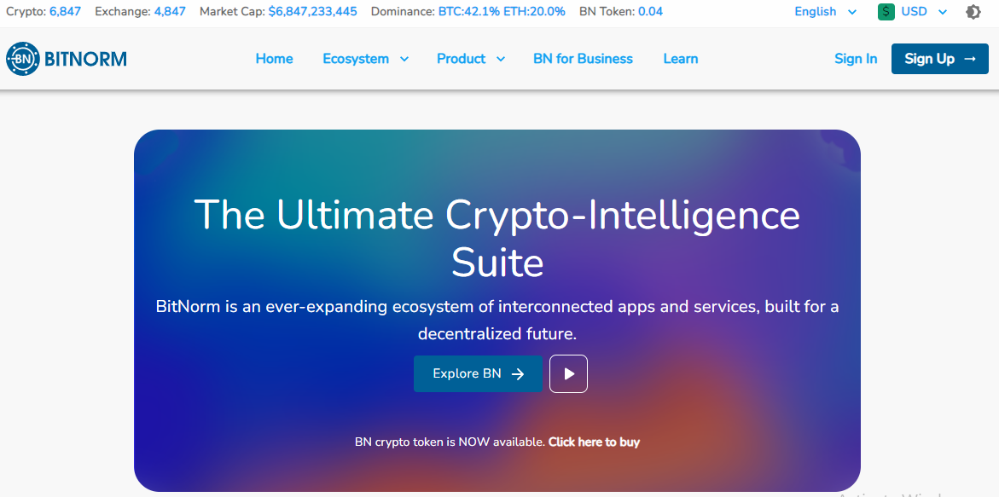

    <a alt="Live" href="https://bitnorm.com/">See Live</a>

BN Social is a BitNorm›s social media tool that allows users from all over the world to connect and share ideas about cryptocurrencies. The wole website is also a PWA.

#####Some Awesome features

- 🚀 &nbsp; Fully functional social Media Site.
- 🚀 &nbsp; Very secure.
- 🚀 &nbsp; Installable PWA with offline access.
- 🚀 &nbsp; External Social Media Links.
- 🚀 &nbsp; Push Notifications.
- 🚀 &nbsp; Email Subscriptions.
