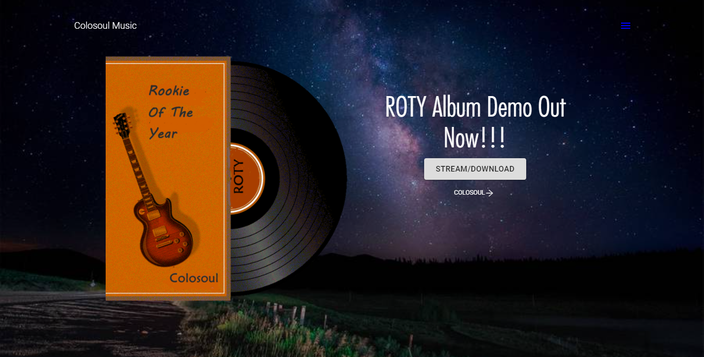

    <a alt="Live" href="https://colosoul-music.netlify.app/">See Live</a> or
    <a alt="Live" href="https://github.com/mkimbo/mkimbo">Source on github</a>

This is another React application that uses gatsby to provide user friendly interface for an upcoming musicians website and online store. It also has an audio player and a music album collection.

#####Some Awesome features

Blazing fast with progress bar loading on each page for slower connections,
Image loading & Optimization,
SEO and Google Analytics,
Online store ( under development ),
Online audio player,
Social Links,
Easily Customizable
