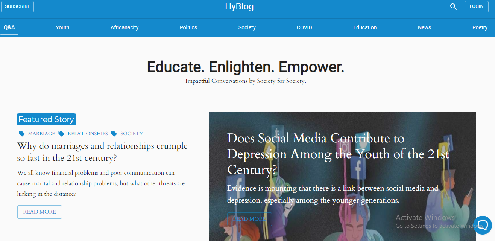

    <a alt="Live" href="https://hyblog.info/">See Live</a> or
    <a alt="Live" href="https://github.com/mkimbo/hyblog-final">Source on github</a>

This is a Feature rich blog application that is blazing fast and SEO ready. . It is made with React/Gatsby and a Firebase database. It is also a Progressive Web App and comes ready with an easy to use Content Management System.

#####Some Awesome features

- 🚀 &nbsp; Blazing fast loading times.
- 🚀 &nbsp; Very secure.
- 🚀 &nbsp; Installable PWA with offline access.
- 🚀 &nbsp; Image loading & Optimization.
- 🚀 &nbsp; SEO and Google Analytics.
- 🚀 &nbsp; External Social Media Links.
- 🚀 &nbsp; Push Notifications.
- 🚀 &nbsp; Email Subscriptions.
- 🚀 &nbsp; Tags and Categories for articles.
