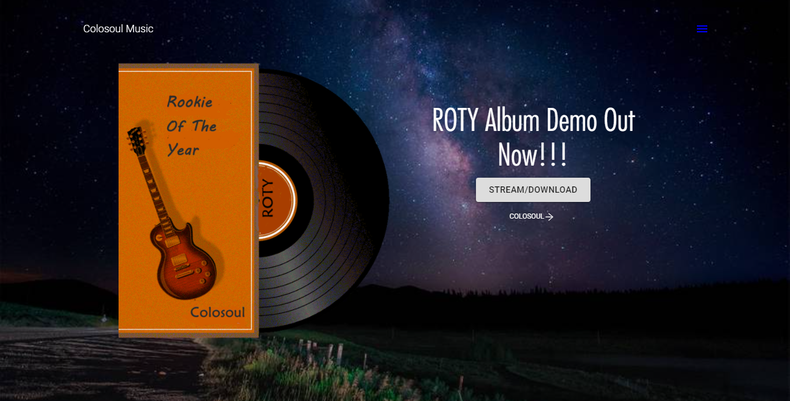

    <a alt="Live" href="https://colosoul-music.netlify.app/">See Live</a> or
    <a alt="Live" href="https://github.com/mkimbo/colosoul-music-client">Source on github</a>

This is another React application that uses gatsby to provide a user friendly interface for an upcoming musicians website and online store. It also has an audio player and a music album collection.

#####Some Awesome features

- 🚀 &nbsp; Blazing fast loading times.
- 🚀 &nbsp; Image loading & Optimization.
- 🚀 &nbsp; SEO and Google Analytics.
- 🚀 &nbsp; Online store ( under development ).
- 🚀 &nbsp; Online audio player,.
- 🚀 &nbsp; Social Links.
