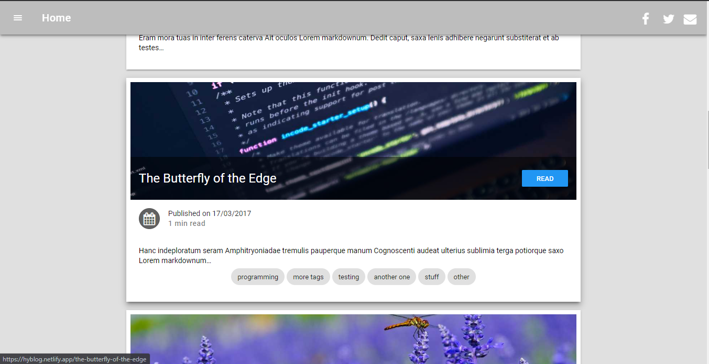

    <a alt="Live" href="https://hyblog.netlify.app/">See Live</a> or
    <a alt="Live" href="https://github.com/mkimbo/mkimbo">Source on github</a>

This is a Feature rich blog application that is blazing fast and SEO ready. It is made with Gatsby and Data from Markdown. It can also be easily intergrated with any Headless CMS such as Contentful and NetlifyCMS or even Wordpress.

#####Some Awesome features

Blazing fast with progress bar loading on each page for slower connections.
Image loading & Optimization
SEO, Google Analytics and RSS Feeds
Social Links
Easily Customizable
