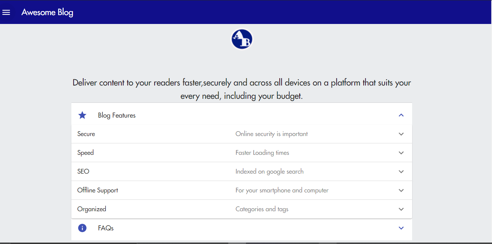

    <a alt="Live" href="https://minimal-awesome-blog.netlify.app/">See Live</a> or
    <a alt="Live" href="https://github.com/mkimbo/mkimbo">Source on github</a>

This is a Feature rich blog application that is blazing fast and SEO ready. It can also be saved on your homescreen to provide offline access to all articles. It is made with React and Data from Markdown. It can also be easily intergrated with any Headless CMS such as Contentful and NetlifyCMS or even Wordpress.

#####Some Awesome features

Blazing fast with progress bar loading on each page for slower connections.
Image loading & Optimization,
SEO and Google Analytics,
Social Links,
Easily Customizable to your specifications
