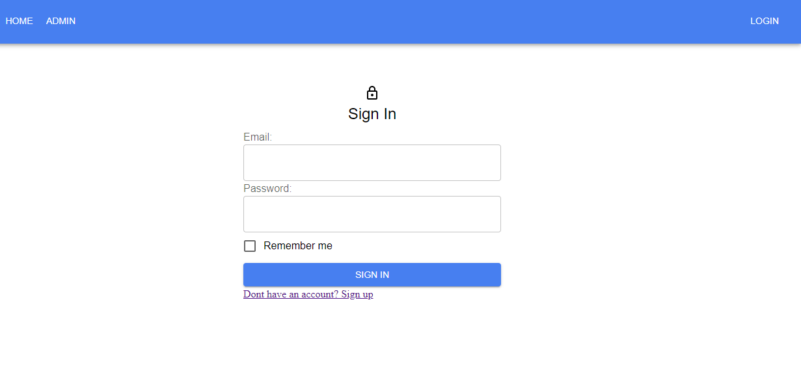

    <a alt="Live" href="https://mern-mini-social.netlify.app/">See Live</a> or
    <a alt="Live" href="https://github.com/mkimbo/mern-project-client">Source on github</a>

This is a simple MERN Stack web application made for practice & learning. It showcases Authentication, CRUD operations on a REST API and deployment to a production environment.

#####Some Awesome features

- 🚀 &nbsp; JWT authentication.
- 🚀 &nbsp; Role-based User authorization.
- 🚀 &nbsp; Secure Token Storage in HttpOnly Cookies.
- 🚀 &nbsp; Persistant Login based on user preference.
- 🚀 &nbsp; REST API for CRUD operations.
- 🚀 &nbsp; Deployment on Netlify and Heroku.
